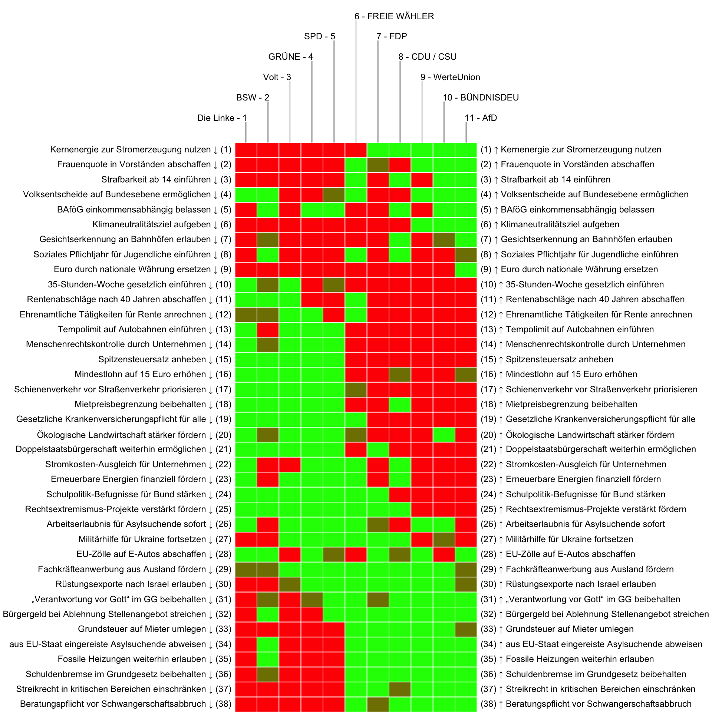
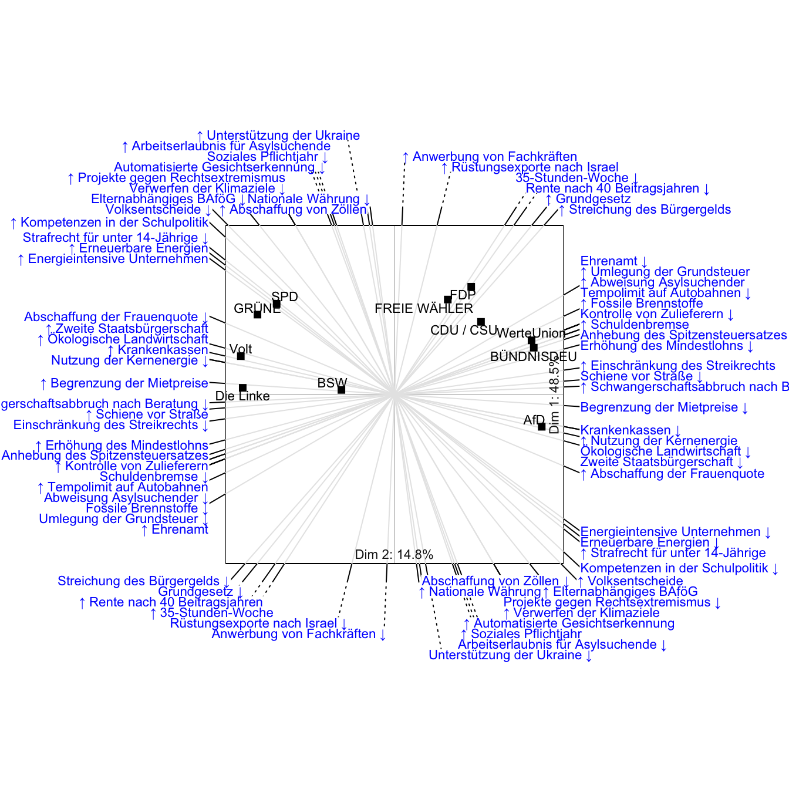

::: {.cell}

:::


Im Folgenden werden die im [Wahl-O-Mat](https://www.wahl-o-mat.de/bundestagswahl2025) der [Bundeszentrale für Politische Bildung](https://www.bpb.de/) (BPB) für die Bundestagswahl 2025 verwendeten politischen Thesen und zugehörigen Parteienpositionen visuell dargestellt.


## Antworten zu den Thesen 

Nachfolgende Grafik (Heatmap) zeigt die Haltung der Parteien zu den 38 im Wahl-O-Mat verwendeten politischen Thesen. Zustimmung und Ablehnung wird durch Farben (grün/rot) dargestellt. Dies ermöglicht einen schnellen Vergleich der Parteipositionen zu verschiedenen Thesen. Die Spalten sind so sortiert, dass Parteien mit ähnlichen Antworten nebeneinander stehen. Man kann so schnell erkennen, welche Parteien inhaltlich nah beieinander liegen. Die Zeilen sind ebenfalls so sortiert, dass Thesen bei denen die Parteien insgesamt ähnlich geantwortet haben untereinander stehen.

**Lesehilfe**

- *Spalten (Parteien)*: Jede Spalte enthält die Antworten einer Partei (z. B. SPD, CDU/CSU, AfD).
- *Zeilen (Thesen)*: Jede Zeile steht für eine politische These (Kurzform), z. B. "Tempolimit auf Autobahnen einführen" oder "Mindestlohn auf 15 Euro erhöhen". Die ausführliche Formulierung der These finden Sie in der Tabelle weiter unten.
- *Farben*:
  - *Grün*: Die Partei unterstützt die These (Aufwärtspfeil, rechte Seite).
  - *Rot*: Die Partei lehnt die These ab (Abwärtspfeil, linke Seite).
  - *Neutral* (dunkle Farbe): neutrale Position.


::: {.cell}
::: {.cell-output-display}
{width=800 height=800}
:::
:::


## Räumliche Darstellung

Die Darstellung unten ist ein *Biplot*. Dies ist eine Variante des Streudiagramms jedoch mit mehr als zwei Achsen. Er ermöglicht sowohl die Beziehungen zwischen den Thesen als auch zwischen den Parteien in einem Bild darzustellen. So interpretiert man die Grafik:

**Punkte (Parteien)**

Die Punkte repräsentieren die Parteien. Ihre Positionen im Raum zeigt zum einen, wie sie in Bezug auf die dargestellten Thesen geantwortet haben. Weiterhin haben Parteien, die nah beieinander sind, tendenziell ähnlich geantwortet.

**Achsen (Thesen)**

Die Achsen repräsentieren die politischen Thesen. Thesen weisen in eine ähnliche Richtung, wenn das Antwortmuster der Parteien auf diesen ähnlich ist. Wenn man das Lot von einem Punkt (Partei) auf eine Achse (These) fällt, kann man tendenziell ablesen, ob die Partei eher zustimmend oder ablehnend ist. Die Mitte (Ursprung des Koordinatensystems) ist das neutrale Zentrum.

*Beispiel*: Die AfD sowie CDU/CSU haben auf der Achse (These) "*Kernenergie zur Stromerzeugung nutzen*" einen hohen Wert, d.h. sie stimmen der These zu. SPD und Grüne haben auf der Achse einen niedrigen Wert, d.h. sie stimmen der These nicht zu. *Hinweis*: Bitte beachten Sie, dass die 2D-Darstellung, nicht alle Werte zu 100% genau repräsentiert.


::: {.cell}
::: {.cell-output-display}
{width=864}
:::
:::


## Die politischen Thesen

Die im Wahl-O-Mat verwendeten Thesen sind in nachfolgender Tabelle aufgelistet. Zur schnelleren Auffindbarkeit ist die Tabelle alphabetisch nach der in den Grafiken genutzten Thesen-Kurzform (von uns erstellt) geordnet.


::: {#tbl-thesen .cell}
::: {.cell-output-display}


```{=html}
<div class="tabwid"><style>.cl-d3282b24{}.cl-d325223a{font-family:'Helvetica';font-size:11pt;font-weight:normal;font-style:normal;text-decoration:none;color:rgba(0, 0, 0, 1.00);background-color:transparent;}.cl-d3266078{margin:0;text-align:left;border-bottom: 0 solid rgba(0, 0, 0, 1.00);border-top: 0 solid rgba(0, 0, 0, 1.00);border-left: 0 solid rgba(0, 0, 0, 1.00);border-right: 0 solid rgba(0, 0, 0, 1.00);padding-bottom:5pt;padding-top:5pt;padding-left:5pt;padding-right:5pt;line-height: 1;background-color:transparent;}.cl-d3266942{width:3in;background-color:transparent;vertical-align: middle;border-bottom: 1.5pt solid rgba(102, 102, 102, 1.00);border-top: 1.5pt solid rgba(102, 102, 102, 1.00);border-left: 0 solid rgba(0, 0, 0, 1.00);border-right: 0 solid rgba(0, 0, 0, 1.00);margin-bottom:0;margin-top:0;margin-left:0;margin-right:0;}.cl-d3266943{width:6in;background-color:transparent;vertical-align: middle;border-bottom: 1.5pt solid rgba(102, 102, 102, 1.00);border-top: 1.5pt solid rgba(102, 102, 102, 1.00);border-left: 0 solid rgba(0, 0, 0, 1.00);border-right: 0 solid rgba(0, 0, 0, 1.00);margin-bottom:0;margin-top:0;margin-left:0;margin-right:0;}.cl-d326694c{width:3in;background-color:transparent;vertical-align: middle;border-bottom: 0 solid rgba(0, 0, 0, 1.00);border-top: 0 solid rgba(0, 0, 0, 1.00);border-left: 0 solid rgba(0, 0, 0, 1.00);border-right: 0 solid rgba(0, 0, 0, 1.00);margin-bottom:0;margin-top:0;margin-left:0;margin-right:0;}.cl-d326694d{width:6in;background-color:transparent;vertical-align: middle;border-bottom: 0 solid rgba(0, 0, 0, 1.00);border-top: 0 solid rgba(0, 0, 0, 1.00);border-left: 0 solid rgba(0, 0, 0, 1.00);border-right: 0 solid rgba(0, 0, 0, 1.00);margin-bottom:0;margin-top:0;margin-left:0;margin-right:0;}.cl-d326694e{width:3in;background-color:transparent;vertical-align: middle;border-bottom: 1.5pt solid rgba(102, 102, 102, 1.00);border-top: 0 solid rgba(0, 0, 0, 1.00);border-left: 0 solid rgba(0, 0, 0, 1.00);border-right: 0 solid rgba(0, 0, 0, 1.00);margin-bottom:0;margin-top:0;margin-left:0;margin-right:0;}.cl-d326694f{width:6in;background-color:transparent;vertical-align: middle;border-bottom: 1.5pt solid rgba(102, 102, 102, 1.00);border-top: 0 solid rgba(0, 0, 0, 1.00);border-left: 0 solid rgba(0, 0, 0, 1.00);border-right: 0 solid rgba(0, 0, 0, 1.00);margin-bottom:0;margin-top:0;margin-left:0;margin-right:0;}</style><table data-quarto-disable-processing='true' class='cl-d3282b24'><thead><tr style="overflow-wrap:break-word;"><th class="cl-d3266942"><p class="cl-d3266078"><span class="cl-d325223a">These (Kurzform)</span></p></th><th class="cl-d3266943"><p class="cl-d3266078"><span class="cl-d325223a">These</span></p></th></tr></thead><tbody><tr style="overflow-wrap:break-word;"><td class="cl-d326694c"><p class="cl-d3266078"><span class="cl-d325223a">35-Stunden-Woche gesetzlich einführen</span></p></td><td class="cl-d326694d"><p class="cl-d3266078"><span class="cl-d325223a">In Deutschland soll die 35-Stunden-Woche als gesetzliche Regelarbeitszeit für alle Beschäftigten festgelegt werden.</span></p></td></tr><tr style="overflow-wrap:break-word;"><td class="cl-d326694c"><p class="cl-d3266078"><span class="cl-d325223a">Arbeitserlaubnis für Asylsuchende sofort</span></p></td><td class="cl-d326694d"><p class="cl-d3266078"><span class="cl-d325223a">Asylsuchende sollen in Deutschland sofort nach ihrer Antragstellung eine Arbeitserlaubnis erhalten.</span></p></td></tr><tr style="overflow-wrap:break-word;"><td class="cl-d326694c"><p class="cl-d3266078"><span class="cl-d325223a">aus EU-Staat eingereiste Asylsuchende abweisen</span></p></td><td class="cl-d326694d"><p class="cl-d3266078"><span class="cl-d325223a">Asylsuchende, die über einen anderen EU-Staat eingereist sind, sollen an den deutschen Grenzen abgewiesen werden.</span></p></td></tr><tr style="overflow-wrap:break-word;"><td class="cl-d326694c"><p class="cl-d3266078"><span class="cl-d325223a">BAföG einkommensabhängig belassen</span></p></td><td class="cl-d326694d"><p class="cl-d3266078"><span class="cl-d325223a">Die Ausbildungsförderung BAföG soll weiterhin abhängig vom Einkommen der Eltern gezahlt werden.</span></p></td></tr><tr style="overflow-wrap:break-word;"><td class="cl-d326694c"><p class="cl-d3266078"><span class="cl-d325223a">Beratungspflicht vor Schwangerschaftsabbruch</span></p></td><td class="cl-d326694d"><p class="cl-d3266078"><span class="cl-d325223a">Schwangerschaftsabbrüche sollen in den ersten drei Monaten weiterhin nur nach Beratung straffrei sein.</span></p></td></tr><tr style="overflow-wrap:break-word;"><td class="cl-d326694c"><p class="cl-d3266078"><span class="cl-d325223a">Bürgergeld bei Ablehnung Stellenangebot streichen</span></p></td><td class="cl-d326694d"><p class="cl-d3266078"><span class="cl-d325223a">Das Bürgergeld soll denjenigen gestrichen werden, die wiederholt Stellenangebote ablehnen.</span></p></td></tr><tr style="overflow-wrap:break-word;"><td class="cl-d326694c"><p class="cl-d3266078"><span class="cl-d325223a">Doppelstaatsbürgerschaft weiterhin ermöglichen</span></p></td><td class="cl-d326694d"><p class="cl-d3266078"><span class="cl-d325223a">In Deutschland soll es weiterhin generell möglich sein, neben der deutschen eine zweite Staatsbürgerschaft zu haben.</span></p></td></tr><tr style="overflow-wrap:break-word;"><td class="cl-d326694c"><p class="cl-d3266078"><span class="cl-d325223a">Ehrenamtliche Tätigkeiten für Rente anrechnen</span></p></td><td class="cl-d326694d"><p class="cl-d3266078"><span class="cl-d325223a">Ehrenamtliche Tätigkeiten sollen auf die zukünftige Rente angerechnet werden.</span></p></td></tr><tr style="overflow-wrap:break-word;"><td class="cl-d326694c"><p class="cl-d3266078"><span class="cl-d325223a">Erneuerbare Energien finanziell fördern</span></p></td><td class="cl-d326694d"><p class="cl-d3266078"><span class="cl-d325223a">Der Ausbau erneuerbarer Energien soll weiterhin vom Staat finanziell gefördert werden.</span></p></td></tr><tr style="overflow-wrap:break-word;"><td class="cl-d326694c"><p class="cl-d3266078"><span class="cl-d325223a">EU-Zölle auf E-Autos abschaffen</span></p></td><td class="cl-d326694d"><p class="cl-d3266078"><span class="cl-d325223a">Deutschland soll sich für die Abschaffung der erhöhten EU-Zölle auf chinesische Elektroautos einsetzen.</span></p></td></tr><tr style="overflow-wrap:break-word;"><td class="cl-d326694c"><p class="cl-d3266078"><span class="cl-d325223a">Euro durch nationale Währung ersetzen</span></p></td><td class="cl-d326694d"><p class="cl-d3266078"><span class="cl-d325223a">Der Euro soll in Deutschland durch eine nationale Währung ersetzt werden.</span></p></td></tr><tr style="overflow-wrap:break-word;"><td class="cl-d326694c"><p class="cl-d3266078"><span class="cl-d325223a">Fachkräfteanwerbung aus Ausland fördern</span></p></td><td class="cl-d326694d"><p class="cl-d3266078"><span class="cl-d325223a">Deutschland soll weiterhin die Anwerbung von Fachkräften aus dem Ausland fördern.</span></p></td></tr><tr style="overflow-wrap:break-word;"><td class="cl-d326694c"><p class="cl-d3266078"><span class="cl-d325223a">Fossile Heizungen weiterhin erlauben</span></p></td><td class="cl-d326694d"><p class="cl-d3266078"><span class="cl-d325223a">Neue Heizungen sollen auch zukünftig vollständig mit fossilen Brennstoffen (z. B. Gas oder Öl) betrieben werden dürfen.</span></p></td></tr><tr style="overflow-wrap:break-word;"><td class="cl-d326694c"><p class="cl-d3266078"><span class="cl-d325223a">Frauenquote in Vorständen abschaffen</span></p></td><td class="cl-d326694d"><p class="cl-d3266078"><span class="cl-d325223a">Die gesetzliche Frauenquote in Vorständen und Aufsichtsräten börsennotierter Unternehmen soll abgeschafft werden.</span></p></td></tr><tr style="overflow-wrap:break-word;"><td class="cl-d326694c"><p class="cl-d3266078"><span class="cl-d325223a">Gesetzliche Krankenversicherungspflicht für alle</span></p></td><td class="cl-d326694d"><p class="cl-d3266078"><span class="cl-d325223a">Alle Bürgerinnen und Bürger sollen in gesetzlichen Krankenkassen versichert sein müssen.</span></p></td></tr><tr style="overflow-wrap:break-word;"><td class="cl-d326694c"><p class="cl-d3266078"><span class="cl-d325223a">Gesichtserkennung an Bahnhöfen erlauben</span></p></td><td class="cl-d326694d"><p class="cl-d3266078"><span class="cl-d325223a">An Bahnhöfen soll die Bundespolizei Software zur automatisierten Gesichtserkennung einsetzen dürfen.</span></p></td></tr><tr style="overflow-wrap:break-word;"><td class="cl-d326694c"><p class="cl-d3266078"><span class="cl-d325223a">Grundsteuer auf Mieter umlegen</span></p></td><td class="cl-d326694d"><p class="cl-d3266078"><span class="cl-d325223a">Die Grundsteuer soll weiterhin auf Mieterinnen und Mieter umgelegt werden dürfen.</span></p></td></tr><tr style="overflow-wrap:break-word;"><td class="cl-d326694c"><p class="cl-d3266078"><span class="cl-d325223a">Kernenergie zur Stromerzeugung nutzen</span></p></td><td class="cl-d326694d"><p class="cl-d3266078"><span class="cl-d325223a">Für die Stromerzeugung soll Deutschland wieder Kernenergie nutzen.</span></p></td></tr><tr style="overflow-wrap:break-word;"><td class="cl-d326694c"><p class="cl-d3266078"><span class="cl-d325223a">Klimaneutralitätsziel aufgeben</span></p></td><td class="cl-d326694d"><p class="cl-d3266078"><span class="cl-d325223a">Deutschland soll das Ziel verwerfen, klimaneutral zu werden.</span></p></td></tr><tr style="overflow-wrap:break-word;"><td class="cl-d326694c"><p class="cl-d3266078"><span class="cl-d325223a">Menschenrechtskontrolle durch Unternehmen</span></p></td><td class="cl-d326694d"><p class="cl-d3266078"><span class="cl-d325223a">Unternehmen sollen weiterhin die Einhaltung der Menschenrechte und des Umweltschutzes bei allen Zulieferern kontrollieren müssen.</span></p></td></tr><tr style="overflow-wrap:break-word;"><td class="cl-d326694c"><p class="cl-d3266078"><span class="cl-d325223a">Mietpreisbegrenzung beibehalten</span></p></td><td class="cl-d326694d"><p class="cl-d3266078"><span class="cl-d325223a">Bei Neuvermietungen sollen die Mietpreise weiterhin gesetzlich begrenzt werden.</span></p></td></tr><tr style="overflow-wrap:break-word;"><td class="cl-d326694c"><p class="cl-d3266078"><span class="cl-d325223a">Militärhilfe für Ukraine fortsetzen</span></p></td><td class="cl-d326694d"><p class="cl-d3266078"><span class="cl-d325223a">Deutschland soll die Ukraine weiterhin militärisch unterstützen.</span></p></td></tr><tr style="overflow-wrap:break-word;"><td class="cl-d326694c"><p class="cl-d3266078"><span class="cl-d325223a">Mindestlohn auf 15 Euro erhöhen</span></p></td><td class="cl-d326694d"><p class="cl-d3266078"><span class="cl-d325223a">Der gesetzliche Mindestlohn soll spätestens 2026 auf 15 Euro erhöht werden.</span></p></td></tr><tr style="overflow-wrap:break-word;"><td class="cl-d326694c"><p class="cl-d3266078"><span class="cl-d325223a">Ökologische Landwirtschaft stärker fördern</span></p></td><td class="cl-d326694d"><p class="cl-d3266078"><span class="cl-d325223a">Ökologische Landwirtschaft soll stärker gefördert werden als konventionelle Landwirtschaft.</span></p></td></tr><tr style="overflow-wrap:break-word;"><td class="cl-d326694c"><p class="cl-d3266078"><span class="cl-d325223a">Rechtsextremismus-Projekte verstärkt fördern</span></p></td><td class="cl-d326694d"><p class="cl-d3266078"><span class="cl-d325223a">Der Bund soll Projekte gegen Rechtsextremismus verstärkt fördern.</span></p></td></tr><tr style="overflow-wrap:break-word;"><td class="cl-d326694c"><p class="cl-d3266078"><span class="cl-d325223a">Rentenabschläge nach 40 Jahren abschaffen</span></p></td><td class="cl-d326694d"><p class="cl-d3266078"><span class="cl-d325223a">Alle Beschäftigten sollen bereits nach 40 Beitragsjahren ohne Abschläge in Rente gehen können.</span></p></td></tr><tr style="overflow-wrap:break-word;"><td class="cl-d326694c"><p class="cl-d3266078"><span class="cl-d325223a">Rüstungsexporte nach Israel erlauben</span></p></td><td class="cl-d326694d"><p class="cl-d3266078"><span class="cl-d325223a">Aus Deutschland sollen weiterhin Rüstungsgüter nach Israel exportiert werden dürfen.</span></p></td></tr><tr style="overflow-wrap:break-word;"><td class="cl-d326694c"><p class="cl-d3266078"><span class="cl-d325223a">Schienenverkehr vor Straßenverkehr priorisieren</span></p></td><td class="cl-d326694d"><p class="cl-d3266078"><span class="cl-d325223a">Beim Ausbau der Verkehrsinfrastruktur soll die Schiene Vorrang vor der Straße haben.</span></p></td></tr><tr style="overflow-wrap:break-word;"><td class="cl-d326694c"><p class="cl-d3266078"><span class="cl-d325223a">Schuldenbremse im Grundgesetz beibehalten</span></p></td><td class="cl-d326694d"><p class="cl-d3266078"><span class="cl-d325223a">Die Schuldenbremse im Grundgesetz soll beibehalten werden.</span></p></td></tr><tr style="overflow-wrap:break-word;"><td class="cl-d326694c"><p class="cl-d3266078"><span class="cl-d325223a">Schulpolitik-Befugnisse für Bund stärken</span></p></td><td class="cl-d326694d"><p class="cl-d3266078"><span class="cl-d325223a">Der Bund soll mehr Kompetenzen in der Schulpolitik erhalten.</span></p></td></tr><tr style="overflow-wrap:break-word;"><td class="cl-d326694c"><p class="cl-d3266078"><span class="cl-d325223a">Soziales Pflichtjahr für Jugendliche einführen</span></p></td><td class="cl-d326694d"><p class="cl-d3266078"><span class="cl-d325223a">Für junge Erwachsene soll ein soziales Pflichtjahr eingeführt werden.</span></p></td></tr><tr style="overflow-wrap:break-word;"><td class="cl-d326694c"><p class="cl-d3266078"><span class="cl-d325223a">Spitzensteuersatz anheben</span></p></td><td class="cl-d326694d"><p class="cl-d3266078"><span class="cl-d325223a">Bei der Besteuerung von Einkommen soll der Spitzensteuersatz angehoben werden.</span></p></td></tr><tr style="overflow-wrap:break-word;"><td class="cl-d326694c"><p class="cl-d3266078"><span class="cl-d325223a">Strafbarkeit ab 14 einführen</span></p></td><td class="cl-d326694d"><p class="cl-d3266078"><span class="cl-d325223a">Unter 14-Jährige sollen strafrechtlich belangt werden können.</span></p></td></tr><tr style="overflow-wrap:break-word;"><td class="cl-d326694c"><p class="cl-d3266078"><span class="cl-d325223a">Streikrecht in kritischen Bereichen einschränken</span></p></td><td class="cl-d326694d"><p class="cl-d3266078"><span class="cl-d325223a">Das Streikrecht für Beschäftigte in Unternehmen der kritischen Infrastruktur soll gesetzlich eingeschränkt werden.</span></p></td></tr><tr style="overflow-wrap:break-word;"><td class="cl-d326694c"><p class="cl-d3266078"><span class="cl-d325223a">Stromkosten-Ausgleich für Unternehmen</span></p></td><td class="cl-d326694d"><p class="cl-d3266078"><span class="cl-d325223a">Energieintensive Unternehmen sollen vom Staat einen finanziellen Ausgleich für ihre Stromkosten erhalten.</span></p></td></tr><tr style="overflow-wrap:break-word;"><td class="cl-d326694c"><p class="cl-d3266078"><span class="cl-d325223a">Tempolimit auf Autobahnen einführen</span></p></td><td class="cl-d326694d"><p class="cl-d3266078"><span class="cl-d325223a">Auf allen Autobahnen soll ein generelles Tempolimit gelten.</span></p></td></tr><tr style="overflow-wrap:break-word;"><td class="cl-d326694c"><p class="cl-d3266078"><span class="cl-d325223a">„Verantwortung vor Gott“ im GG beibehalten</span></p></td><td class="cl-d326694d"><p class="cl-d3266078"><span class="cl-d325223a">Im einleitenden Satz des Grundgesetzes soll weiterhin die Formulierung „Verantwortung vor Gott“ stehen.</span></p></td></tr><tr style="overflow-wrap:break-word;"><td class="cl-d326694e"><p class="cl-d3266078"><span class="cl-d325223a">Volksentscheide auf Bundesebene ermöglichen</span></p></td><td class="cl-d326694f"><p class="cl-d3266078"><span class="cl-d325223a">In Deutschland soll es auf Bundesebene Volksentscheide geben können.</span></p></td></tr></tbody></table></div>
```


:::
:::


## Daten und Methodik

Genutzt wurde der Wahl-O-Mat-Datensatz der Bundeszentrale für Politische Bildung (BPB) <https://www.bpb.de/themen/wahl-o-mat/bundestagswahl-2025/558463/download/>

Die Daten und Grafiken wurden in der [R Software](https://www.r-project.org/) aufbereitet. Die Zustimmung zu einer These wurde mit `1`, Neutralität mit `0` und Ablehnung mit `-1` codiert. Den Code finden Sie [hier](https://github.com/markheckmann/wahlomat/). 

In der Heatmap (erste Grafik) wurden die Zeilen und Spalten nach den Ladungen der Parteien bzw. Thesen auf den ersten beiden Hauptkomponenten im Uhrzeigersinn sortiert. So entsteht eine Anordnung der Spalten (Parteien) und Zeilen (Thesen) nach Ähnlichkeit, die zugleich der Anordnung im Biplot entspricht.
