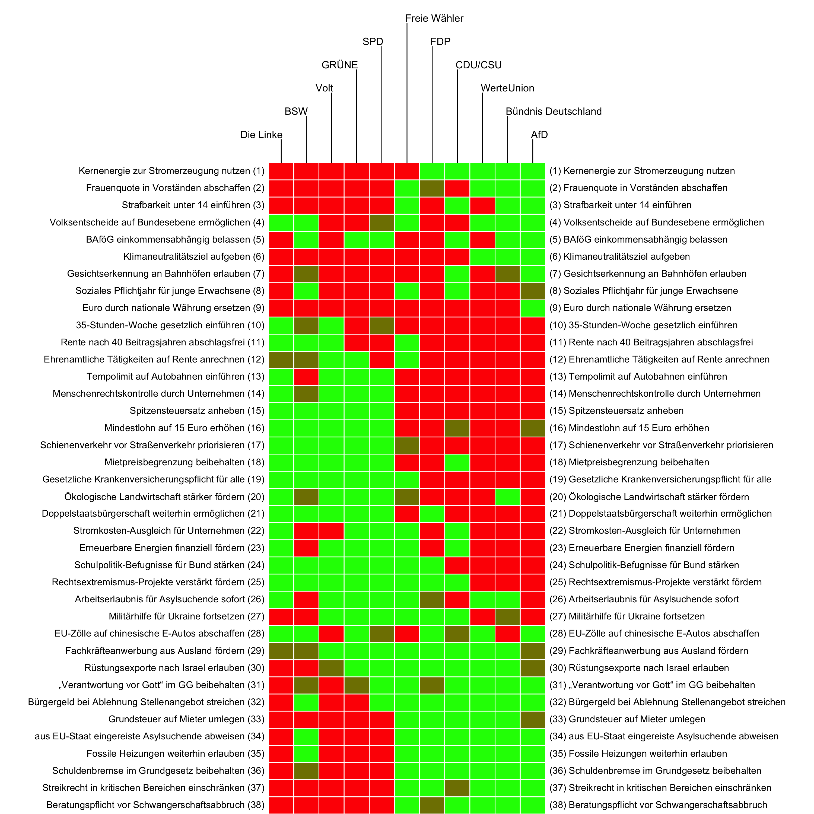
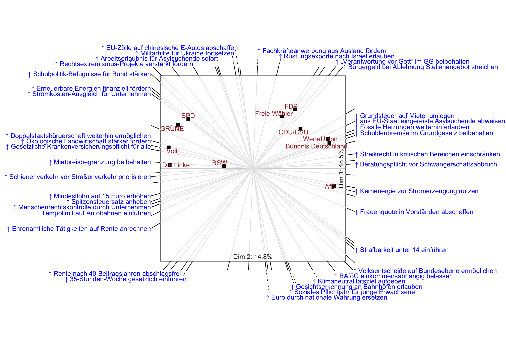

# Parteien und Thesen des ‘Wahl-O-Mat’ 2025

Im Folgenden werden die im
[Wahl-O-Mat](https://www.wahl-o-mat.de/bundestagswahl2025) der
[Bundeszentrale für Politische Bildung](https://www.bpb.de/) (BPB) für
die Bundestagswahl 2025 verwendeten politischen Thesen und zugehörigen
Parteienpositionen visuell dargestellt.

## Antworten zu den Thesen

Nachfolgende Grafik (Heatmap) zeigt die Haltung *ausgewählter* Parteien
(aus Gründen der Übersichtlichkeit) zu den 38 im Wahl-O-Mat verwendeten
politischen Thesen. Zustimmung und Ablehnung wird durch Farben
(grün/rot) dargestellt. Dies ermöglicht einen schnellen Vergleich der
Parteipositionen zu verschiedenen Thesen. Die Spalten sind so sortiert,
dass Parteien mit ähnlichen Antworten nebeneinander stehen. Man kann so
schnell erkennen, welche Parteien inhaltlich nah beieinander liegen. Die
Zeilen sind ebenfalls so sortiert, dass Thesen bei denen die Parteien
insgesamt ähnlich geantwortet haben untereinander stehen.

**Lesehilfe**

- *Spalten (Parteien)*: Jede Spalte enthält die Antworten einer Partei
  (z. B. SPD, CDU/CSU, AfD).
- *Zeilen (Thesen)*: Jede Zeile steht für eine politische These
  (Kurzform), z. B. “Tempolimit auf Autobahnen einführen” oder
  “Mindestlohn auf 15 Euro erhöhen”. Die ausführliche Formulierung der
  These finden Sie in der Tabelle weiter unten.
- *Farben*:
  - *Grün*: Die Partei unterstützt die These.
  - *Rot*: Die Partei lehnt die These ab.
  - *Neutral* (dunkle Farbe): neutrale Position.

## Räumliche Darstellung

Die Darstellung unten ist ein *Biplot*. Dies ist eine Variante des
Streudiagramms jedoch mit mehr als zwei Achsen. Er ermöglicht sowohl die
Beziehungen zwischen den Thesen als auch zwischen den Parteien in einem
Bild darzustellen. So interpretiert man die Grafik:

**Punkte (Parteien)**

Die Punkte repräsentieren die Parteien. Ihre Positionen im Raum zeigt
zum einen, wie sie in Bezug auf die dargestellten Thesen geantwortet
haben. Weiterhin haben Parteien, die nah beieinander sind, tendenziell
ähnlich geantwortet.

**Achsen (Thesen)**

Die Achsen repräsentieren die politischen Thesen. Die Achse zeigt stets
in Richtung *Zustimmung zur These*, was durch den kleinen Aufwärtspfeil
vor der These angedeutet wird. Thesen mit einem ähnlichen Antwortmuster
zeigen in eine ähnliche Richtung. Wenn man das Lot von einem Punkt
(Partei) auf eine Achse (These) fällt, kann man tendenziell ablesen, ob
die Partei eher zustimmend oder ablehnend ist. Die Mitte (Ursprung des
Koordinatensystems) ist das neutrale Zentrum.

*Beispiel*: Die AfD sowie CDU/CSU haben auf der Achse (These)
“*Kernenergie zur Stromerzeugung nutzen*” einen hohen Wert, d.h. sie
stimmen der These zu. SPD und Grüne haben auf der Achse einen niedrigen
Wert, d.h. sie stimmen der These nicht zu. *Hinweis*: Bitte beachten
Sie, dass die 2D-Darstellung die Position der Parteien auf den
Achsen/Thesen nicht 100% genau abbildet.

## Alle Parteien

Die nachfolgend Darstellung zeigt alle Parteien und Thesen. Die Zeilen
(Thesen) und Spalten (Parteien) sind nach Ähnlichkeit gruppiert. Die
baumartigen Strukturen unten und rechts (sog. Dendrogramme) zeigen an,
wie ähnlich sich die Bewertungsmuster der Parteien oder Thesen sind.

## Die politischen Thesen

Die im Wahl-O-Mat verwendeten Thesen sind in nachfolgender Tabelle
aufgelistet. Zur schnelleren Auffindbarkeit ist die Tabelle alphabetisch
nach der in den Grafiken genutzten Thesen-Kurzform (von uns erstellt)
geordnet.

| Kurzform | These |
|:---|:---|
| 35-Stunden-Woche gesetzlich einführen | In Deutschland soll die 35-Stunden-Woche als gesetzliche Regelarbeitszeit für alle Beschäftigten festgelegt werden. |
| Arbeitserlaubnis für Asylsuchende sofort | Asylsuchende sollen in Deutschland sofort nach ihrer Antragstellung eine Arbeitserlaubnis erhalten. |
| aus EU-Staat eingereiste Asylsuchende abweisen | Asylsuchende, die über einen anderen EU-Staat eingereist sind, sollen an den deutschen Grenzen abgewiesen werden. |
| BAföG einkommensabhängig belassen | Die Ausbildungsförderung BAföG soll weiterhin abhängig vom Einkommen der Eltern gezahlt werden. |
| Beratungspflicht vor Schwangerschaftsabbruch | Schwangerschaftsabbrüche sollen in den ersten drei Monaten weiterhin nur nach Beratung straffrei sein. |
| Bürgergeld bei Ablehnung Stellenangebot streichen | Das Bürgergeld soll denjenigen gestrichen werden, die wiederholt Stellenangebote ablehnen. |
| Doppelstaatsbürgerschaft weiterhin ermöglichen | In Deutschland soll es weiterhin generell möglich sein, neben der deutschen eine zweite Staatsbürgerschaft zu haben. |
| Ehrenamtliche Tätigkeiten für Rente anrechnen | Ehrenamtliche Tätigkeiten sollen auf die zukünftige Rente angerechnet werden. |
| Erneuerbare Energien finanziell fördern | Der Ausbau erneuerbarer Energien soll weiterhin vom Staat finanziell gefördert werden. |
| EU-Zölle auf E-Autos abschaffen | Deutschland soll sich für die Abschaffung der erhöhten EU-Zölle auf chinesische Elektroautos einsetzen. |
| Euro durch nationale Währung ersetzen | Der Euro soll in Deutschland durch eine nationale Währung ersetzt werden. |
| Fachkräfteanwerbung aus Ausland fördern | Deutschland soll weiterhin die Anwerbung von Fachkräften aus dem Ausland fördern. |
| Fossile Heizungen weiterhin erlauben | Neue Heizungen sollen auch zukünftig vollständig mit fossilen Brennstoffen (z. B. Gas oder Öl) betrieben werden dürfen. |
| Frauenquote in Vorständen abschaffen | Die gesetzliche Frauenquote in Vorständen und Aufsichtsräten börsennotierter Unternehmen soll abgeschafft werden. |
| Gesetzliche Krankenversicherungspflicht für alle | Alle Bürgerinnen und Bürger sollen in gesetzlichen Krankenkassen versichert sein müssen. |
| Gesichtserkennung an Bahnhöfen erlauben | An Bahnhöfen soll die Bundespolizei Software zur automatisierten Gesichtserkennung einsetzen dürfen. |
| Grundsteuer auf Mieter umlegen | Die Grundsteuer soll weiterhin auf Mieterinnen und Mieter umgelegt werden dürfen. |
| Kernenergie zur Stromerzeugung nutzen | Für die Stromerzeugung soll Deutschland wieder Kernenergie nutzen. |
| Klimaneutralitätsziel aufgeben | Deutschland soll das Ziel verwerfen, klimaneutral zu werden. |
| Menschenrechtskontrolle durch Unternehmen | Unternehmen sollen weiterhin die Einhaltung der Menschenrechte und des Umweltschutzes bei allen Zulieferern kontrollieren müssen. |
| Mietpreisbegrenzung beibehalten | Bei Neuvermietungen sollen die Mietpreise weiterhin gesetzlich begrenzt werden. |
| Militärhilfe für Ukraine fortsetzen | Deutschland soll die Ukraine weiterhin militärisch unterstützen. |
| Mindestlohn auf 15 Euro erhöhen | Der gesetzliche Mindestlohn soll spätestens 2026 auf 15 Euro erhöht werden. |
| Ökologische Landwirtschaft stärker fördern | Ökologische Landwirtschaft soll stärker gefördert werden als konventionelle Landwirtschaft. |
| Rechtsextremismus-Projekte verstärkt fördern | Der Bund soll Projekte gegen Rechtsextremismus verstärkt fördern. |
| Rentenabschläge nach 40 Jahren abschaffen | Alle Beschäftigten sollen bereits nach 40 Beitragsjahren ohne Abschläge in Rente gehen können. |
| Rüstungsexporte nach Israel erlauben | Aus Deutschland sollen weiterhin Rüstungsgüter nach Israel exportiert werden dürfen. |
| Schienenverkehr vor Straßenverkehr priorisieren | Beim Ausbau der Verkehrsinfrastruktur soll die Schiene Vorrang vor der Straße haben. |
| Schuldenbremse im Grundgesetz beibehalten | Die Schuldenbremse im Grundgesetz soll beibehalten werden. |
| Schulpolitik-Befugnisse für Bund stärken | Der Bund soll mehr Kompetenzen in der Schulpolitik erhalten. |
| Soziales Pflichtjahr für Jugendliche einführen | Für junge Erwachsene soll ein soziales Pflichtjahr eingeführt werden. |
| Spitzensteuersatz anheben | Bei der Besteuerung von Einkommen soll der Spitzensteuersatz angehoben werden. |
| Strafbarkeit ab 14 einführen | Unter 14-Jährige sollen strafrechtlich belangt werden können. |
| Streikrecht in kritischen Bereichen einschränken | Das Streikrecht für Beschäftigte in Unternehmen der kritischen Infrastruktur soll gesetzlich eingeschränkt werden. |
| Stromkosten-Ausgleich für Unternehmen | Energieintensive Unternehmen sollen vom Staat einen finanziellen Ausgleich für ihre Stromkosten erhalten. |
| Tempolimit auf Autobahnen einführen | Auf allen Autobahnen soll ein generelles Tempolimit gelten. |
| „Verantwortung vor Gott“ im GG beibehalten | Im einleitenden Satz des Grundgesetzes soll weiterhin die Formulierung „Verantwortung vor Gott“ stehen. |
| Volksentscheide auf Bundesebene ermöglichen | In Deutschland soll es auf Bundesebene Volksentscheide geben können. |

## Daten und Methodik

Genutzt wurde der Wahl-O-Mat-Datensatz der Bundeszentrale für Politische
Bildung (BPB)
<https://www.bpb.de/themen/wahl-o-mat/bundestagswahl-2025/558463/download/>

Die Daten und Grafiken wurden in der [R
Software](https://www.r-project.org/) aufbereitet. Die Zustimmung zu
einer These wurde mit `1`, Neutralität mit `0` und Ablehnung mit `-1`
codiert. Den Code finden Sie
[hier](https://github.com/markheckmann/wahlomat/).

In der Heatmap (erste Grafik) wurden die Zeilen und Spalten nach den
Ladungen der Parteien bzw. Thesen auf den ersten beiden Hauptkomponenten
im Uhrzeigersinn sortiert. So entsteht eine Anordnung der Spalten
(Parteien) und Zeilen (Thesen) nach Ähnlichkeit, die zugleich der
Anordnung im Biplot entspricht.
